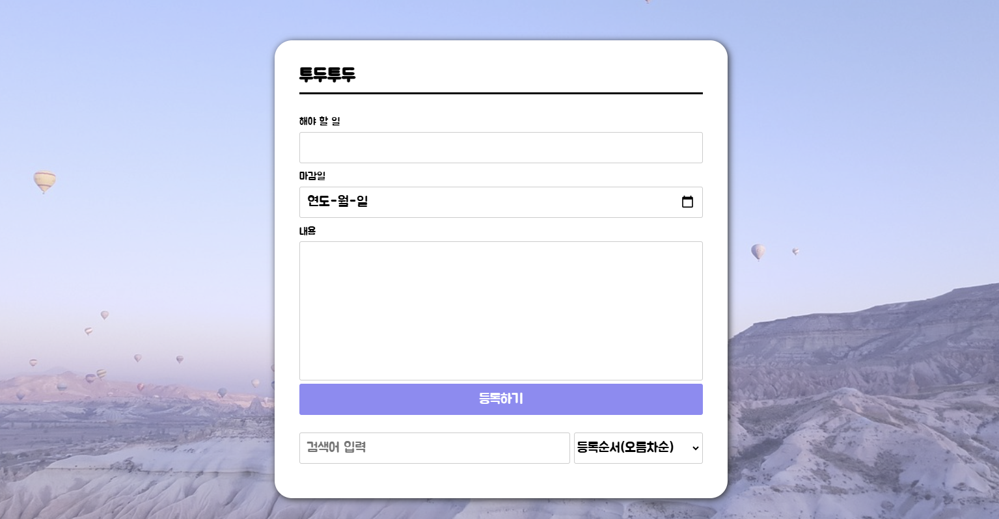

# Todo List

[사이트 바로가기](https://todo.jinilog.com/)

### 개발 기간
2024.12.19 ~ 2024.12.24

### 프로젝트 설명
- 자신의 일정을 관리할 수 있는 미니프로젝트입니다.
- 일정 추가, 완료설정, 삭제 할 수 있는 서비스를 제공합니다.

### Skills
HTML, CSS, JavaScript, AWS, Docker

### 개선점
- 검색 기능 추가

    사용자가 입력한 키워드에 따라 제목이나 내용으로 할 일을 쉽게 검색할 수 있도록 구현하였습니다.

- 작업 고유 번호(seq) 생성

    작업 등록 시 Date.now()를 사용하여 고유한 seq를 생성하고 배열에 추가함으로써 각 작업을 식별하고 관리할 수 있도록 하였습니다.

- 작업 완료 상태 관리

    라디오 버튼을 통해 각 작업의 상태를 완료 / 진행중으로 구분할 수 있도록 기능을 추가하였습니다.

- 아코디언 UI 구성

    클릭 시 상세내용이 펼쳐지고, 다른 항목은 자동으로 닫히는 아코디언 방식으로 개선하였습니다.

- LocalStorage 저장 추가

    새로고침시에 입력한 내용들이 사라지는 현상이 있어 웹 브라우저가 데이터를 사용자의 컴퓨터에 저장하여 새로고침 이후에도 작업 목록이 유지되도록 구현하였습니다.

- 정렬 기능 추가

    마감일 순 또는 생성일 순으로 오름 / 내림 정렬할 수 있는 옵션을 제공해 사용자가 편리하게 작업을 관리할 수 있도록 하였습니다.

